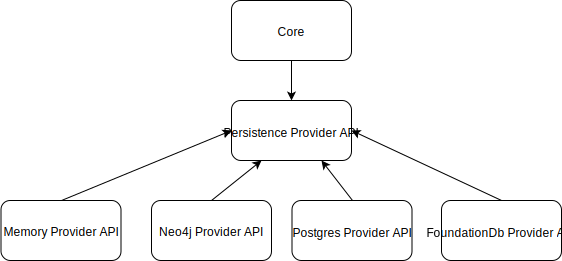

= Architecture

ifdef::env-github[]
:tip-caption: :bulb:
:note-caption: :information_source:
:important-caption: :heavy_exclamation_mark:
:caution-caption: :fire:
:warning-caption: :warning:
:toc-placement: preamble
endif::[]

== Features

* An idempotent resource-oriented REST API configured at runtime according to JSON Schema
* Data modelling using JSON Schema
* Structured storage of JSON Documents according to schemas
* Link data with another
* Write links even before the data you are linking to, has been created
* Time-based versioning (live time machine)
* Provider based persistence storage capability
** Chose between: PostgreSQL, Neo4j, FoundationDb or BigTable

== Overview

== How it works

Please refer to
ifdef::env-github[]
link:examples.adoc#example-json-schema[JSON Schema]
endif::[]
ifndef::env-github[]
<<example-json-schema>>
endif::[]
examples section on how to use.

